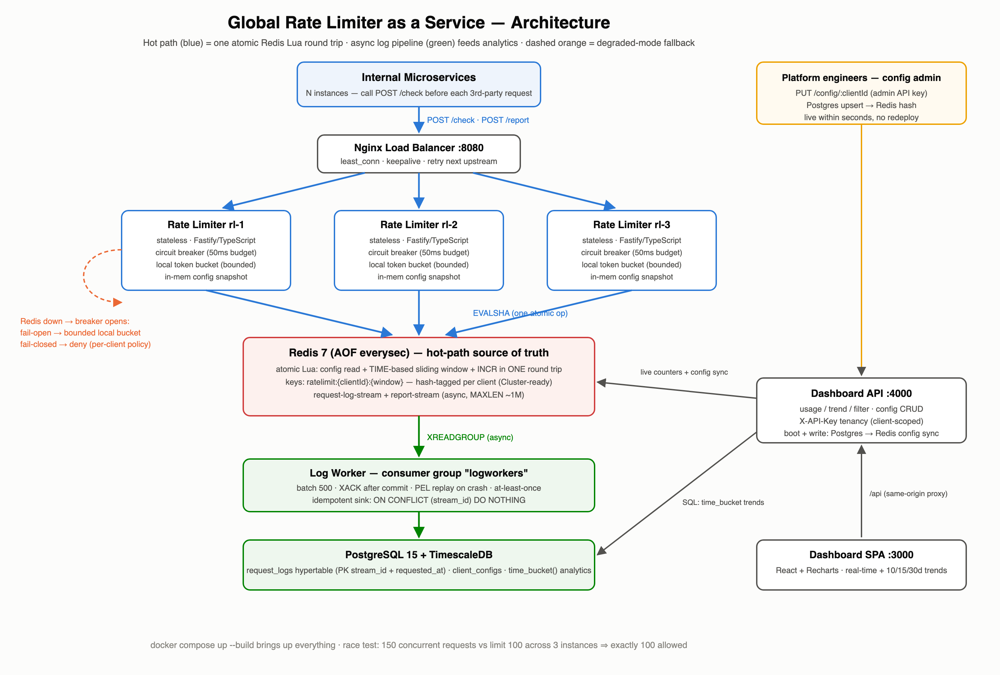

# Global Rate Limiter as a Service

A highly available, cluster-accurate rate limiter that internal microservices consult
before calling quota-bound third-party APIs (banking, logistics, AI models). One atomic
Redis Lua round trip per decision, an async log pipeline for billing/analytics, and a
real-time dashboard — all runnable with a single command.



*(also provided as `diagram/architecture.jpg` per the deliverable spec; design docs in
[PRD.md](PRD.md) and [TRD.md](TRD.md))*

---

## Quick start

```bash
docker compose up --build
```

That single command brings up the entire stack:

| Service | URL / port | Role |
|---|---|---|
| Nginx load balancer | `http://localhost:8080` | entry point for `/check`, `/report`, `/health`, `/metrics` |
| Rate limiter ×3 (`rl-1..3`) | behind nginx | stateless decision instances |
| Redis 7 (AOF) | `localhost:6379` | atomic counters + log streams |
| Log worker | — | stream → Postgres batch writer |
| Postgres 15 + TimescaleDB | `localhost:5432` | analytics/billing store (`ratelimiter`/`ratelimiter`) |
| Dashboard API | `http://localhost:4000` | usage/trend/filter + config CRUD |
| Dashboard SPA | `http://localhost:3000` | React + Recharts UI |

Seeded demo clients (from the assignment brief):

| Client | Limit | Outage policy | Dashboard API key |
|---|---|---|---|
| `client-a` | 100 req/min | fail-open | `key-client-a` |
| `client-b` | 5000 req/min | fail-open | `key-client-b` |
| `bank-strict` | 50 req/min | **fail-closed** | `key-bank-strict` |
| `test-race-client` | 100 req/min | fail-open | `key-test-race` |
| admin (all clients + config CRUD) | — | — | `key-admin` |

### Try it

```bash
# Ask for permission to call a third-party API on behalf of client-a:
curl -s -X POST http://localhost:8080/check \
  -H 'Content-Type: application/json' -d '{"clientId":"client-a"}'
# → {"allowed":true,"remaining":99,"requestId":"…","mode":"normal"}

# After making your third-party call, optionally report its outcome
# (enriches billing/analytics with real upstream response times):
curl -s -X POST http://localhost:8080/report \
  -H 'Content-Type: application/json' \
  -d '{"requestId":"<from /check>","upstreamResponseTimeMs":142,"upstreamStatus":200}'

# Exhaust a quota (client-a allows 100/min):
for i in $(seq 1 105); do curl -s -X POST http://localhost:8080/check \
  -H 'Content-Type: application/json' -d '{"clientId":"client-a"}' | tail -c 60; echo; done
# → the last five show "allowed":false with a retryAfterMs hint

# Change a limit live — no redeploy (FR1/FR7):
curl -s -X PUT http://localhost:4000/config/client-a \
  -H 'Content-Type: application/json' -H 'X-API-Key: key-admin' \
  -d '{"limitPerWindow":200,"windowSeconds":60,"onOutage":"open"}'
```

Open the dashboard at **http://localhost:3000**, enter `key-client-a` (or `key-admin`
to switch between clients): real-time usage vs quota (2s polling against live Redis
counters), allowed/denied trends and response-time graphs over 10/15/30 days with
hourly/daily bucketing.

---

## How it works

### The decision hot path (one atomic round trip)

Every `/check` executes a single Redis Lua script
([slidingWindow.lua.ts](services/ratelimiter/src/redis/slidingWindow.lua.ts)) that reads
the client's config, computes the **sliding-window-counter** estimate
(`previous·(1−elapsed) + current`), and increments — indivisibly. Redis executes Lua
atomically, so the classic race (two concurrent requests both read 99/100 and both get
approved) cannot happen, no matter how many limiter instances or calling-service
instances are running. **The Lua script is the concurrency control; there is no
distributed lock** — that's what keeps p99 in the low milliseconds.

Three deliberate details:

- **Time comes from `redis.call('TIME')`**, not app clocks — container clock skew can
  never make two instances disagree about the current window.
- **Config is read inside the script** — one round trip total, not two.
- **Keys are hash-tagged** (`ratelimit:{clientId}:…`) so all of a client's keys share a
  slot — the property Redis Cluster would require for multi-key scripts.

### Fail-safe strategy (Redis outage)

Explicit, tunable trade-off (TRD §5) rather than hidden behavior:

1. Every Redis call has a **50ms budget** (`REDIS_COMMAND_TIMEOUT_MS`); repeated
   failures open a **circuit breaker** (threshold 3, cool-down 2s) — a dead Redis costs
   *zero* latency, not a timeout per request.
2. While the breaker is open, decisions come from a **local in-memory token bucket**
   seeded conservatively: `limit × FALLBACK_FRACTION(0.5) ÷ INSTANCE_COUNT(3)` per
   window per instance — so the fleet-wide worst case during an outage is ~50% of the
   real quota. Business traffic keeps flowing; overage risk stays bounded.
3. **Per-client policy override**: clients where overage carries hard financial
   penalties can set `onOutage: "closed"` (see `bank-strict`) — they are denied during
   the outage instead.
4. Fallback needs each client's limit while Redis is down, so every instance keeps an
   **in-memory last-known-good config snapshot** (refreshed every 10s in normal
   operation) — no network dependency in degraded mode.
5. A half-open probe closes the breaker when Redis recovers; activations are logged,
   counted in metrics (`ratelimiter_fallback_activations_total`) and visible in
   `/health` (`mode: normal | fallback`).

### Async logging pipeline (billing-grade)

- The limiter `XADD`s every decision to a Redis Stream **fire-and-forget** — logging
  never adds latency to, and can never fail, a decision. During an outage, entries
  buffer in memory (bounded at 10k) and drain on recovery.
- The **log worker** consumes via a consumer group, batch-inserts to Postgres, and
  `XACK`s only after commit. Delivery is at-least-once; the sink is **idempotent**
  (stream entry ID is part of the PK, `ON CONFLICT DO NOTHING`) — so a worker crash
  causes replay, never loss or double-billing.
- Redis runs with **AOF `everysec`**: buffered stream entries survive restarts. The
  documented residual gap: a hard crash can lose ≤1s of buffered log entries.

**Two response-time metrics, never conflated:** decision latency (measured on every
request) vs upstream response time (reported by callers via `POST /report`, joined to
the log row by `requestId`). The dashboard labels report coverage explicitly.

---

## API summary

### Rate limiter (via nginx, `:8080`)

| Endpoint | Description |
|---|---|
| `POST /check` `{clientId}` | → `{allowed, remaining, retryAfterMs?, requestId, mode}`. 200 for allow *and* deny (denial is data, not an HTTP error); 404 unknown client; 400 malformed. |
| `POST /report` `{requestId, upstreamResponseTimeMs, upstreamStatus}` | post-hoc upstream outcome (202) |
| `GET /health` | mode (normal/fallback), breaker state, Redis status, snapshot age, log buffer |
| `GET /metrics` | Prometheus: decision latency histogram, allow/deny counters, fallback activations |

### Dashboard API (`:4000`, all requests need `X-API-Key`)

| Endpoint | Description |
|---|---|
| `GET /usage/:clientId/current` | real-time usage vs quota (live Redis counters) |
| `GET /usage/:clientId/trend?days=10\|15\|30&bucket=hour\|day` | allowed/denied counts + latency averages per bucket |
| `GET /usage/:clientId/filter?metric=avgResponseTime\|avgDecisionLatency\|count&from=&to=&bucket=&outcome=` | free-form filtered queries |
| `GET /config/:clientId` / `PUT /config/:clientId` (admin) | read / live-update limits |
| `GET /clients` | clients visible to this key |

Non-admin keys are scoped server-side to their own client — Client A cannot read
Client B's usage.

---

## Running the tests

### 1. Unit tests (no infrastructure needed)

```bash
cd services/ratelimiter && npm install && npm test
```

43 tests: sliding-window math edge cases (window boundaries, burst-at-boundary,
retry hints), token-bucket refill/bounds, circuit-breaker state machine, config
snapshot parsing, and decision orchestration under simulated Redis failure.

### 2. Race-condition test (the correctness proof)

With the stack up:

```bash
docker compose --profile test run --rm race-test
```

Fires **150 truly concurrent** `/check` requests for `test-race-client`
(limit 100/min) **through the load balancer across all three instances**, and asserts
**exactly 100 allowed / 50 denied** — any non-atomic implementation over-admits here.
The test first verifies requests actually distribute across ≥2 instances, waits for a
fresh window if needed, and resets counter keys (the sliding-window estimate is only
exact when the previous window is empty — see TRD §4.2/§10.2).

### 3. Load & performance tests (k6)

```bash
docker compose --profile test run --rm k6 run /scripts/load.js   # sustained: ~Client B's 5000/min, thresholds p95<5ms / p99<25ms, errors<0.1%
docker compose --profile test run --rm k6 run /scripts/spike.js  # 20→400 rps spike: bounded latency, no errors — denials are the limiter working
```

**Reading latency correctly:** k6 measures at the HTTP layer, where the load
generator, nginx, all app containers and Redis share one Docker VM — on a busy
laptop the worst 1% of requests absorb scheduler stalls that are not the
limiter's doing (observed: HTTP p99 <1ms idle vs ~17ms busy, same code). The
authoritative measurement for the "few ms" SLA is the in-process decision
histogram the service itself exports:

```bash
curl -s http://localhost:8080/metrics | grep decision_latency_ms_bucket
# typical: >92% of decisions <1ms, ~99% <8ms even with the load generator
# fighting the stack for the same cores
```

### 4. Chaos / edge-case tests

```bash
./tests/chaos/run-chaos.sh
```

Scenario 1 — **Redis outage**: stops Redis mid-traffic, asserts fail-open clients keep
flowing in `fallback` mode, the fail-closed client (`bank-strict`) is denied, and
instances recover to `normal` after Redis restarts.
Scenario 2 — **log worker crash**: sends 40 requests, kills the worker mid-consumption,
restarts it, and asserts Postgres gains **exactly 40 rows with zero duplicates**
(consumer-group PEL replay + idempotent sink).

Manual verification of the same edge cases:

```bash
docker compose stop redis          # watch /check keep answering with "mode":"fallback"
curl -s http://localhost:8080/health   # → mode: fallback, breaker: open
docker compose start redis         # within ~2s: mode: normal
```

---

## Design decisions & trade-offs (summary)

| Decision | Why | Trade-off accepted |
|---|---|---|
| Sliding window counter | accurate at window boundaries, O(1) memory per client | weighted estimate, not exact across windows (exact within a fresh window) |
| Lua script as the only concurrency control | atomic by Redis's execution model; no locks on the hot path | all decisions serialize through Redis (fine at this scale; Cluster-ready keys for growth) |
| Fail-open + bounded local bucket (default) | business keeps moving during outages | bounded risk of over-quota, tunable via `FALLBACK_FRACTION`, per-client `closed` override |
| Redis Streams (not Kafka) | one less heavyweight dependency; consumer groups give replay | lower throughput ceiling; swap-in point documented |
| At-least-once + idempotent sink | simpler and honest vs claiming exactly-once | duplicate deliveries hit `ON CONFLICT DO NOTHING` |
| AOF `everysec` | log durability across restarts | ≤1s loss window on hard crash |
| TimescaleDB hypertable | fast `time_bucket()` trend queries at 10/15/30 days | composite PK required (partition-column rule) |

Production notes (out of scope for this deliverable, per PRD §6): Redis Sentinel/Cluster
for store-level HA (the client code is env-driven and Sentinel-ready; single Redis+AOF
keeps the one-command demo deterministic), hashed API keys, TLS, and continuous
aggregates for very long dashboard ranges.

## Repository layout

```
├── docker-compose.yml          # the single-command stack (+ test profiles)
├── nginx/                      # load balancer config
├── db/init/                    # schema + seed (auto-applied on first boot)
├── services/
│   ├── ratelimiter/            # hot path: Lua script, breaker, fallback, snapshot
│   ├── logworker/              # stream consumer → idempotent Postgres batches
│   ├── dashboard-api/          # usage/trend/filter + config CRUD + tenancy
│   └── dashboard-frontend/     # React + Recharts SPA
├── tests/
│   ├── race/                   # cross-instance race-condition test
│   ├── k6/                     # load + spike tests
│   └── chaos/                  # outage + crash-recovery scenarios
├── diagram/                    # architecture diagram (svg + png + jpg)
├── PRD.md / TRD.md             # product + technical design docs
```
